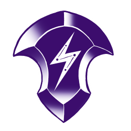
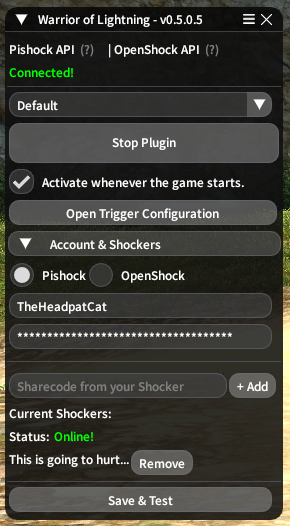
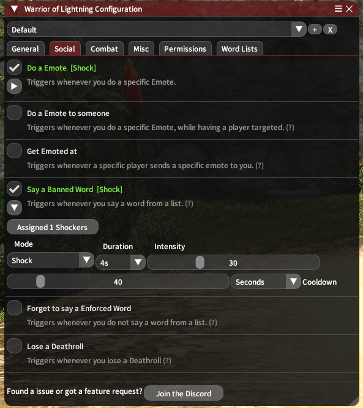

# A FFXIV Plugin that integrates PiShock and OpenShock devices into the Game.

## Main Goal and Features of this Plugin  
  
This is a Plugin for the Game Final Fantasy XIV Online. It's main purpose is to connect specific Real Life devices to the Game, allowing interactions between them.  
More specifically, the devices chosen are small "Shockers" from the "Pishock" and "OpenShock" Projects.  
Through the use of such a device, one can receive more direct feedback from the interactions within the Game.  
While the original intentions for these devices where marketed more towards Adult usage, this Plugin bridges the gap towards a more playful use.  
  
Further below are all the implemented interactions that the Plugin is able to pick up on. All of the Features are "Opt-in" and highly customizeable.  
  
  
Important Note: This Repository is a archived copy of the original, still ongoing Project.  
Some Statistics on the state of this Plugin:  
- 8990 Lines of Source Code  
- 84 Built Versions  
- 9 Major Versions  
- 3 Major Reworks/Revisions  
- First Prototype Released on May 25, 2024  
- Performance Impacts with all Features enabled (using Median Hardware from 20.05.25)  
  - Average Frame Impact ~0.005ms (>0.001% of a Frame @60FPS)  
  - Worst Case Frame Impact ~0.07ms (>0.01% of a Frame @60FPS)  
    
    

Preview of the Main UI Interface captures Ingame:  

  
## Current Features
 - Social Triggers:  
 Doing a specified Emote  
 Doing a specified Emote to someone  
 Getting emoted at by someone  
 Saying a Banned Word from a List  
 Forgetting to say a Enforced Word from a List  
 Losing a Deathroll  
 
 - Combat Triggers:  
 Dying  
 Failing a Mechanic  
 Any Partymember dies  
 Party Wipes  
 Taking any kind of Damage  

 - Misc Triggers:  
 Sitting on Furniture
 Fail a Craft
 Fail to catch a Fish  

- Presets for quick swapping of Settings    

- A safeword with /red  
  This disables all functionalities from the plugin until used again.
  
  

  
  
## Installation:  
  
You have to use the [XIVQuicklauncher](https://goatcorp.github.io/) with Dalamud enabled for this to work.  
  
Ingame, open the Dalamud Settings, navigate to the "Experimental" Tab and scroll down.  
There you find "Custom Plugin Repositories" - Important do not mix this up with "Dev Plugins" at the top!  
You will then have to enter this link into the list:  
`https://raw.githubusercontent.com/TheHeadPatCat/DalamudPlugins/main/repo.json`  
Save it via the plus sign on the right and then the floppy disk on the bottom right.  
Then, open the Plugin Installer and search for "Warrior of Lightning"  
  
  
## Setup:  
  
Once installed, click on "Open" to open the Main Window.  
Here you can enable or disable the entire Plugin at any point - this is so it only actually shocks you when you are ready for it.  
Alternatively, there is a fast way to disable it using the command `/red`, this will instantly stop all operations and ignores all Settings - until used again.  
Lastly, the "Activate whenever the game starts" is there to automatically activate the plugin right away, when you login.  
  
Firstly, on the very bottom under "Account & Shockers" you can swap between your Pishock and OpenShock account data. Both are usable at the same time though!  
  
For Pishock, you will need:  
- Your Username. It's what you use to login to the Pishock Website and what shows up on it.  
- Your API Key. If you have used a different application before, you should already have it saved somewhere on your machine - but if this is your first time: on the Website at the top left, click on "Account" and then "Generate API Key". Save it somewhere on your Machine, as clicking this button a second time, invalidates your previous key.  
  
For OpenShock, you will need:  
- The URL of the API you want to access. This is only if you selfhost a server, so if you use the default OpenShock API, just leave it as is.  
- A API Token. You can get this on the Website under "API Tokens". Generate one and enter it here.  

To finish it off, press the "Save & Conect" button and give it a moment to figure everything out.  
If you did everything correctly, all of your available Shockers (even Shared ones) should show up!  
If they don't... Check what is shown under the API Connection at the top of the Window.  
Maybe you accidentally put something wrong, or the Plugin is having a weird issue. If that happens, please report it on the Discord!  
  
You can click on "Test" on any of the Shockers to send out a 1 second Vibration on 35%.  
If it doesn't arrive for some reason, make sure that the Shocker is properly connected, and the Hub is turned on!  

## Configuration

After you have gotten all of this behind you, you can start customizing your experience!  
Click on "Open Configuration" to open a big Window, hosting all of the available options.  
You can enable as many Rules as you want, and assign any mix and amount of Shockers to them.  

